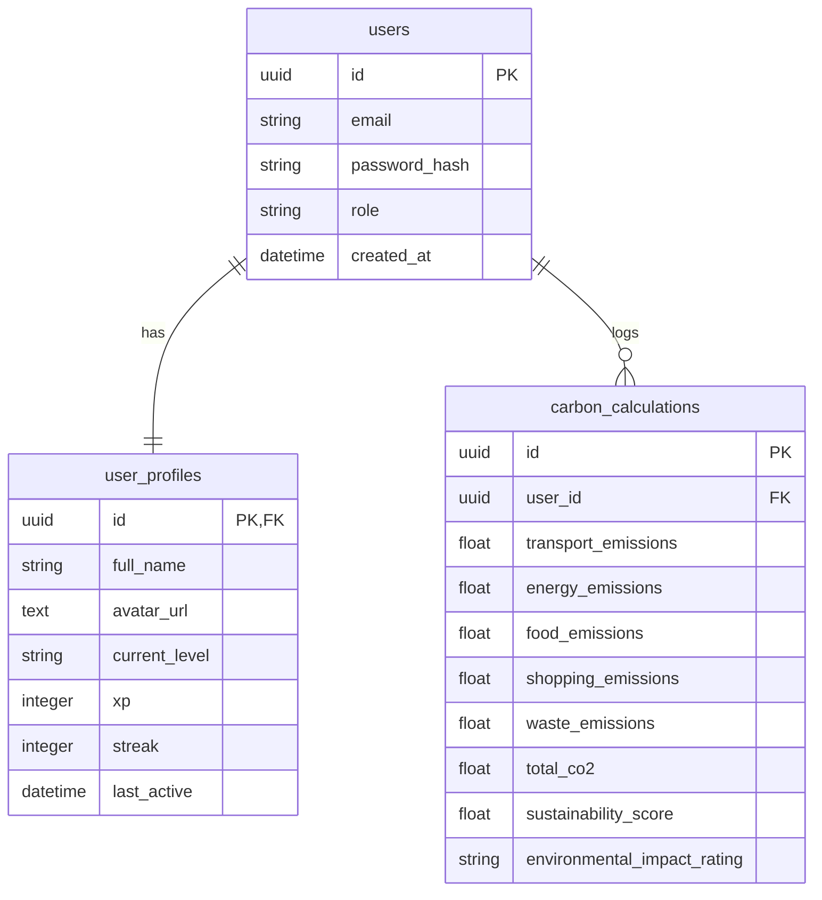

# TerraMind AI — AI-Powered Climate Intelligence Platform

[](https://fastapi.tiangolo.com)
[](https://nextjs.org)
[](https://www.postgresql.org)
[](https://threejs.org)

TerraMind AI is a comprehensive, production-ready climate intelligence platform. It features a Next.js 15 frontend, styled with premium custom emerald glassmorphic cards and micro-animations, integrated with a FastAPI backend. The platform provides automated carbon footprint accounting, machine learning-based emission forecasting, multi-agent AI task orchestration, and complete gamification streaks/XP features.

---

## Table of Contents
- [Overview](#overview)
- [Features](#features)
- [Tech Stack](#tech-stack)
- [Architecture](#architecture)
- [Folder Structure](#folder-structure)
- [Installation & Setup](#installation--setup)
- [Environment Variables](#environment-variables)
- [Running the Application](#running-the-application)
- [API Documentation](#api-documentation)
- [Database Schema](#database-schema)
- [Deployment Guide](#deployment-guide)
- [Troubleshooting](#troubleshooting)
- [License](#license)

---

## Overview
TerraMind AI aims to empower users, companies, and city administrators to track, analyze, and offset carbon footprints. By combining raw carbon tracking data, predictive algorithms, and collaborative AI recommendations, it facilitates active sustainable decisions.

---

## Features

### 🔐 Authentication & Profile
- **JWT Authentication**: High-security token generation and payload encryption using HS256.
- **Google OAuth Login**: Ready-to-go Google credentials login handler.
- **Streaks & XP Levels**: Automatic daily tracking metrics mapping XP level upgrades based on user carbon mitigation performance.

### 📊 Sustainability Dashboard
- **Mission Control**: Live telemetry meters showing monthly/annual footprints, sustainability score, and environmental grade.
- **Trend Charts**: Recharts-powered graphs comparing historical usage variables across transit, energy, and food.

### 🧪 Carbon Calculator
- **Granular Inputs**: Detail transport modes (car, flight, transit, bike), energy mix (LPG, grid, renewable), waste recycling ratios, food diets, and shopping.
- **Live Output**: Calculations based on standard DEFRA/EPA emission factors.

### 🤖 AI Coach & Multi-Agent Diagnostics
- **AI Coach**: A responsive conversational bot analyzing user carbon data to suggest personalized reductions, backed by rule-based fallbacks if OpenAI keys are absent.
- **Command Center**: Dispatch CrewAI/LangGraph workflows triggering parallel agent audits (Travel, Shopping, Energy).

### 🏆 Gamification
- **Leaderboard**: Live monthly rank sorting user profiles by XP score.
- **Badge Shelf**: Unlock achievements like *Eco Starter*, *Earth Saver*, *Zero Waster*, and *Carbon Cutter*.
- **Eco Challenges**: Active challenges (e.g. *Car-Free Week*, *Vegan Monday*) with custom claim reward logic.

### 🏙️ Smart City & Climate Map
- **Smart City**: Track AQI levels, pm2.5 curves, and renewable grid share ratios for metropolitan cities.
- **Climate Map**: Dynamic Three.js 3D global wireframe showcasing hot-spot risks and sustainability ranks per country.

### 🛒 Offset Marketplace
- **Green Projects**: Purchase units from forest plantings, solar grids, or ocean cleanup projects, unlocking corresponding badges and XP.

### 📄 Reports & Analytics
- **Exports**: Instantly generate clean PDF summaries using ReportLab and CSV format sheets.

---

## Tech Stack

| Layer | Technology |
| :--- | :--- |
| **Frontend Framework** | Next.js 15 (React 19, TypeScript) |
| **Backend Framework** | FastAPI (Python 3.11) |
| **Database & ORM** | PostgreSQL & SQLite Fallback (SQLAlchemy ORM) |
| **Styling** | Tailwind CSS v4, Vanilla CSS variables |
| **AI Integration** | OpenAI API, CrewAI, LangChain |
| **Visualizations** | Recharts, Lucide React icons, Three.js (3D Globe) |
| **Verification / Testing** | Pytest, Next.js Compiler |

---

## Architecture

```text
       ┌────────────────────────┐
       │   Next.js 15 Client    │
       │    (Port 3000 / UI)    │
       └───────────┬────────────┘
                   │
                   │ HTTP REST / JSON Fetch Calls
                   ▼
       ┌────────────────────────┐
       │    FastAPI Gateway     │
       │   (Port 8000 / API)    │
       └─────┬───────────┬──────┘
             │           │
             │           │ SQLAlchemy Async ORM
             ▼           ▼
  ┌─────────────┐     ┌───────────────────────┐
  │  AI Agents  │     │ PostgreSQL DB / SQLite│
  │  & Models   │     │  (Port 5432 / local)  │
  └─────────────┘     └───────────────────────┘
```

---

## Folder Structure

```text
TerraMind AI/
├── backend/
│   ├── app/
│   │   ├── db/
│   │   │   ├── models.py         # SQLAlchemy definitions
│   │   │   ├── schema.sql         # SQL DDL schemas
│   │   │   └── session.py        # Db Session engine config
│   │   ├── routes/
│   │   │   ├── admin.py
│   │   │   ├── agents.py
│   │   │   ├── auth.py
│   │   │   ├── calculator.py
│   │   │   ├── climate_map.py
│   │   │   ├── coach.py
│   │   │   ├── gamification.py
│   │   │   ├── marketplace.py
│   │   │   ├── predictions.py
│   │   │   ├── reports.py
│   │   │   └── smart_city.py
│   │   ├── services/
│   │   │   ├── ai_agents.py      # LLM & fallback coordinators
│   │   │   ├── calculations.py   # Emission factor math
│   │   │   ├── ml_engine.py      # Scikit-learn predictions
│   │   │   └── pdf_gen.py        # PDF layouts
│   │   ├── config.py
│   │   ├── main.py               # FastAPI core entrypoint
│   │   └── schemas.py            # Pydantic schema validation
│   ├── tests/
│   │   ├── conftest.py           # Pytest configs and clients
│   │   ├── test_api.py           # Integration API tests
│   │   └── test_calculator.py    # Carbon math tests
│   ├── requirements.txt
│   └── Dockerfile
├── frontend/
│   ├── src/
│   │   ├── app/
│   │   │   ├── admin/
│   │   │   ├── agents/
│   │   │   ├── auth/
│   │   │   ├── calculator/
│   │   │   ├── coach/
│   │   │   ├── dashboard/
│   │   │   ├── gamification/
│   │   │   ├── map/
│   │   │   ├── marketplace/
│   │   │   ├── reports/
│   │   │   ├── simulator/
│   │   │   ├── smart-city/
│   │   │   ├── globals.css
│   │   │   ├── layout.tsx
│   │   │   └── page.tsx
│   │   ├── components/
│   │   │   ├── BackgroundShaders.tsx
│   │   │   ├── DashboardShell.tsx
│   │   │   └── ThreeGlobe.tsx
│   │   └── context/
│   │       └── AppContext.tsx    # Context API fetches & fallback mock data
│   ├── next.config.ts
│   ├── package.json
│   ├── tsconfig.json
│   └── Dockerfile
└── docker-compose.yml
```

---

## Installation & Setup

### Requirements
- **Node.js**: v20 or newer
- **Python**: v3.11 or newer
- **Docker & Compose**: (Optional, for unified container build)

### Step-by-Step Setup

1. **Clone the Repository**:
   ```bash
   git clone <repository_url>
   cd "TerraMind AI"
   ```

2. **Configure Environment Variables**:
   Copy `.env.example` to the root `.env` and `backend/.env` directories:
   ```bash
   cp .env.example .env
   cp .env.example backend/.env
   ```

3. **Install Backend Dependencies**:
   ```bash
   cd backend
   python3 -m venv venv
   source venv/bin/activate
   pip install -r requirements.txt
   ```

4. **Install Frontend Dependencies**:
   ```bash
   cd ../frontend
   npm install
   ```

---

## Environment Variables

The application relies on the following environment configurations:

| Name | Purpose | Required |
| :--- | :--- | :--- |
| `DATABASE_URL` | PostgreSQL connection string. Defaults to local SQLite `sqlite:///./terramind_ai.db` if omitted. | Optional |
| `JWT_SECRET` | Key used to sign JWT authorization tokens. | Required |
| `OPENAI_API_KEY` | Key for AI coach and agent command centers. Defaults to rule-based fallback generator if empty. | Optional |
| `APP_SECRET_KEY` | Encryption key for cookie sessions. | Required |
| `ALLOWED_ORIGINS` | Permitted URLs for CORS origins. | Optional |

---

## Running the Application

### Running with Docker Compose (Recommended)
You can build and start all containers (Database, Backend, and Frontend) in one command:
```bash
docker-compose up --build
```
- Frontend will load at `http://localhost:3000`
- Backend Swagger APIs will load at `http://localhost:8000/docs`

### Running Locally (Manual Mode)

1. **Start Database & Backend**:
   ```bash
   cd backend
   source venv/bin/activate
   python3 -m uvicorn app.main:app --port 8000 --reload
   ```

2. **Start Frontend Server**:
   ```bash
   cd frontend
   npm run dev
   ```
   Open [http://localhost:3000](http://localhost:3000) in your web browser.

### Running Test Suite

#### Backend (FastAPI) Test Suite
Execute pytest to run security, calculations, marketplace, and gamification tests with coverage metrics:
```bash
cd backend
python -m pytest tests/ -v --cov=app --cov-report=term-missing
```

#### Frontend (Next.js) Test Suite
Execute Jest to run client API client and input validation tests:
```bash
cd frontend
npm test
```

---

## API Documentation

FastAPI automatically serves interactive API docs at `/docs` (Swagger UI) or `/redoc` (ReDoc).

### Auth Endpoints
- **`POST /api/auth/signup`**: Create user and profile. Returns access token.
- **`POST /api/auth/login`**: Authenticate and return JWT token.
- **`POST /api/auth/google`**: Authenticate via Google payload.
- **`GET /api/auth/profile`**: Retrieve profile details (XP, Level, Streak).

### Calculator Endpoints
- **`POST /api/calculator/calculate`**: Accept raw emission usage and return calculated tons values.
- **`GET /api/calculator/history`**: Retrieve previous calculations.

### Gamification Endpoints
- **`GET /api/gamification/leaderboard`**: Return ranked active users sorted by XP.
- **`GET /api/gamification/badges`**: Retrieve earned badges.
- **`GET /api/gamification/challenges`**: Fetch open challenge metrics.

---

## Database Schema



---

## Troubleshooting

- **401 Unauthorized errors in frontend**: Make sure the JWT token is saved properly in `localStorage` (`terramind_ai_token`) and is valid. Try logging out and signing up again.
- **Database Connection Failure**: If not running PostgreSQL, verify the `DATABASE_URL` fallback points to the local SQLite database.
- **FastAPI Startup Failure**: Ensure port `8000` is free. Verify python packages are correctly installed via the virtual environment.

---

## License
Refer to the standard MIT License included within this repository workspace.
