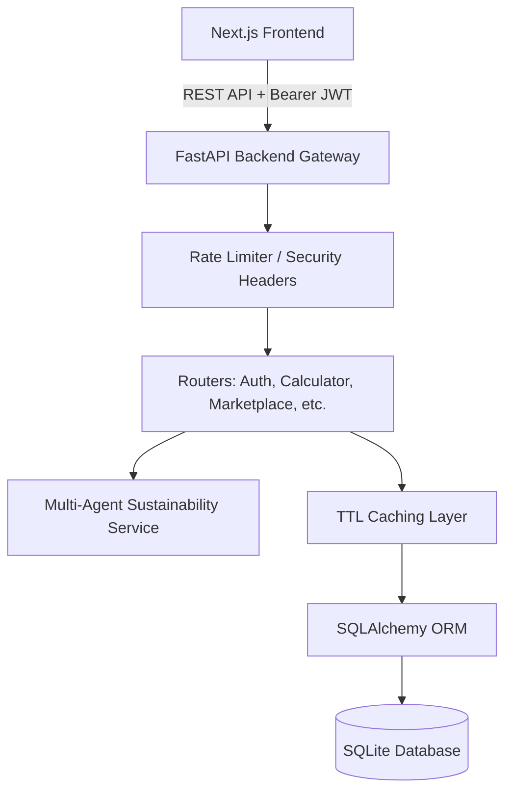

# System Architecture — TerraMind AI

This document details the software architecture, database design, caching layers, and multi-agent service design of the **TerraMind AI** platform.

---

## 1. High-Level Component Map

The platform consists of a React/Next.js frontend and a FastAPI (Python) backend connected to a local SQLite database.

---

## 2. Design Patterns & Performance Optimizations

### Thread-Safe TTL Cache
To reduce database load on static or slow-changing datasets, the backend implements an in-memory TTL (Time-To-Live) cache in `backend/app/services/cache.py`.
- **Used for**: `/smart-city/statistics` queries, caching the DB aggregation results for 5 minutes.
- **Implementation**: Uses a thread-safe mutex and dict registry keeping expiration timestamps.

### Database Indexing Strategy
To ensure optimal performance as users grow:
1. **Composite index `ix_carbon_calculations_user_timestamp`** on `(user_id, timestamp)`: Speeds up historical carbon log analysis queries and analytics plotting.
2. **Composite index `ix_leaderboard_period_xp`** on `(period, xp)`: Speeds up sorting/ranking within gamified leaderboards.

---

## 3. Security Model

- **Authentication**: JWT token-based authentication using HS256 algorithm with strict validation of default tokens in production.
- **Middleware Hardening**: Starlette-based `SecurityHeadersMiddleware` injection enforcing CSP, Frame-Options, XSS protection, and MIME type sniffing protection.
- **Input Sanitization**: Cross-Site Scripting (XSS) prevention utilizing regex-based HTML/CSS tag stripping (`sanitize_string`) inside both the Pydantic schemas and UI helper files.
- **Token Invalidation**: Custom JWT logout blacklist handling to prevent replay attacks post-session destruction.
